# AUTO.RIA Toyota Monitor Bot

Telegram bot for automatic monitoring of Toyota listings on AUTO.RIA. It tracks new listings, price changes, and sold 
vehicles.

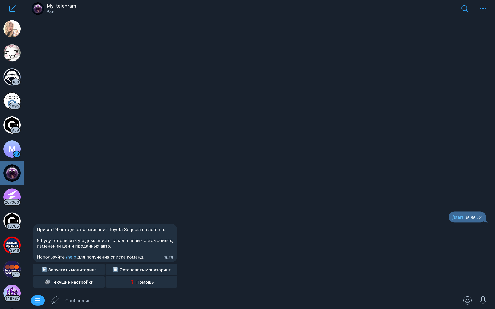
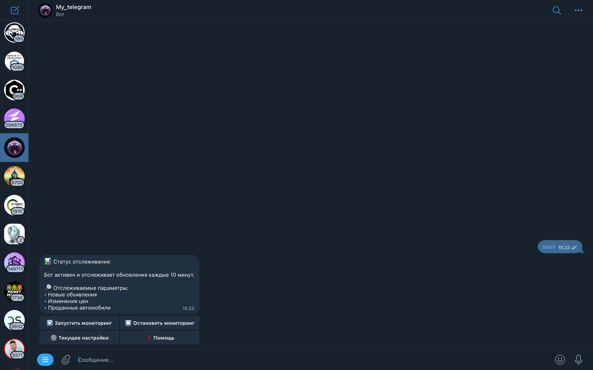
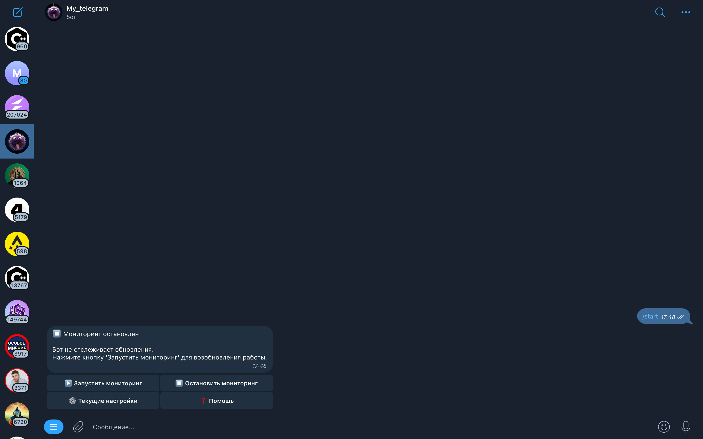
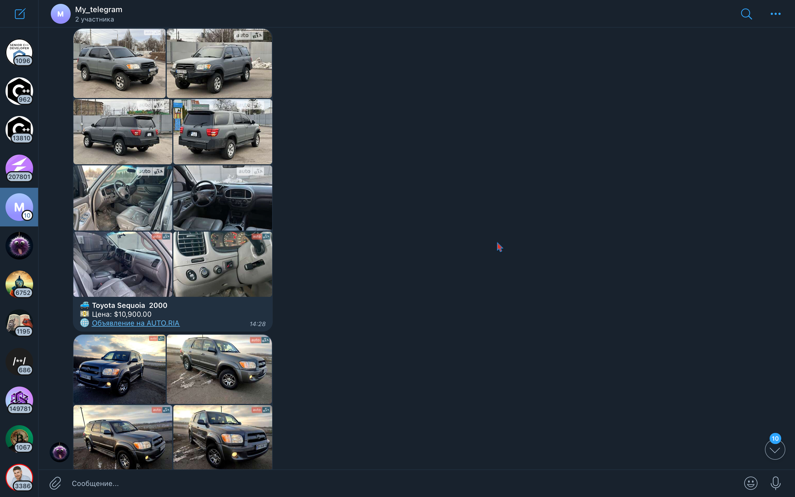
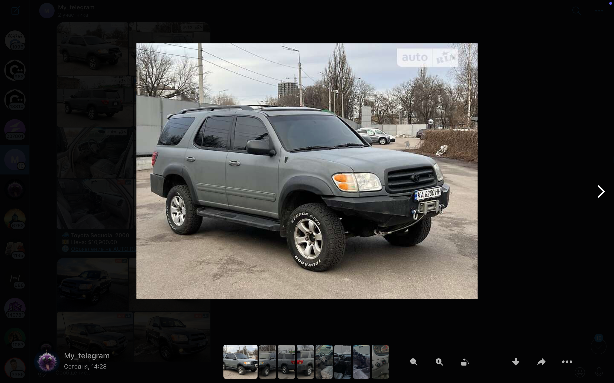
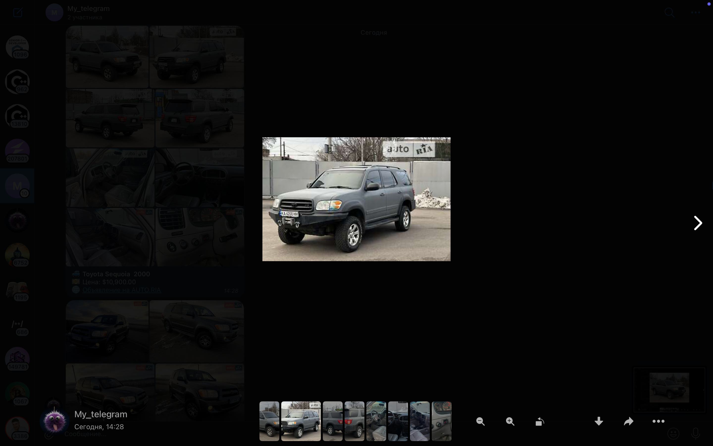
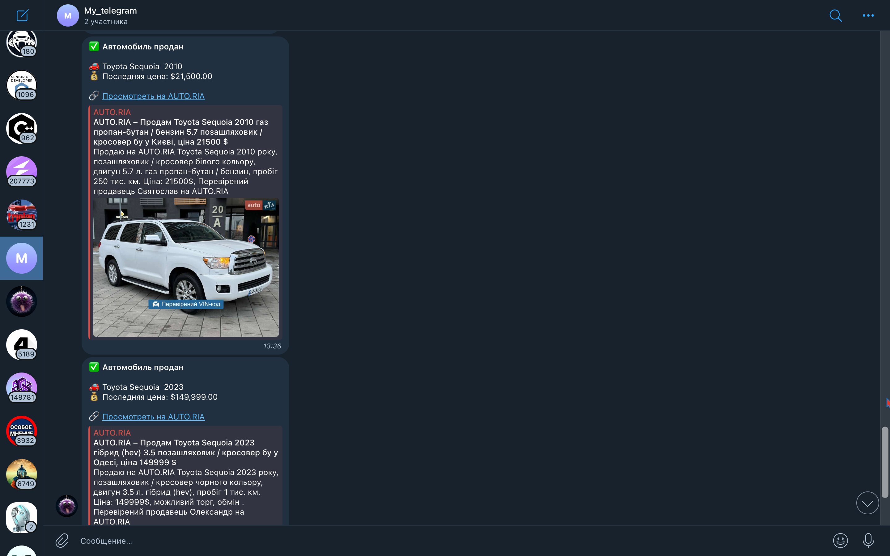

## Main Features
1. 🔍 Monitoring new Toyota listings
2. 💰 Tracking price changes
3. ✅ Notifications about sold cars
4. 🖼️ Downloading photos from AUTO.RIA
5. 🔨 Integration with auctions (Copart, IAAI)
6. ⚙️ Customizable search parameters

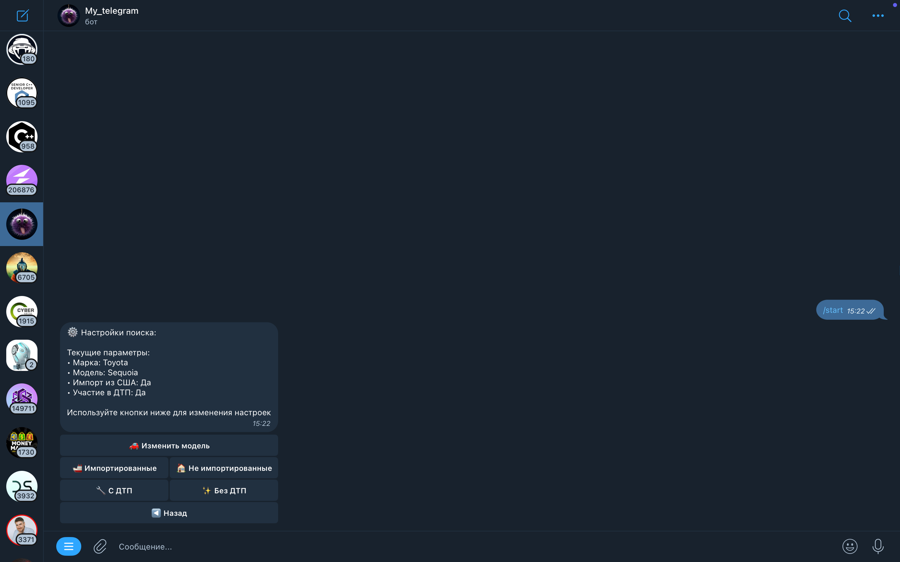
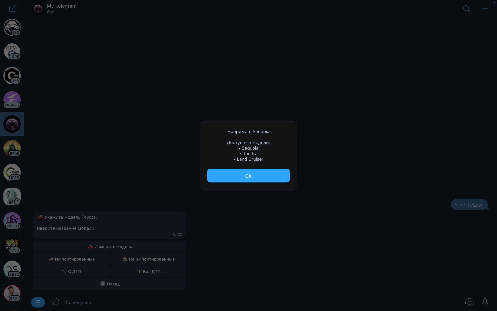
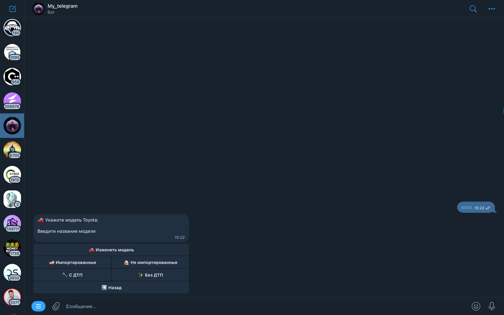
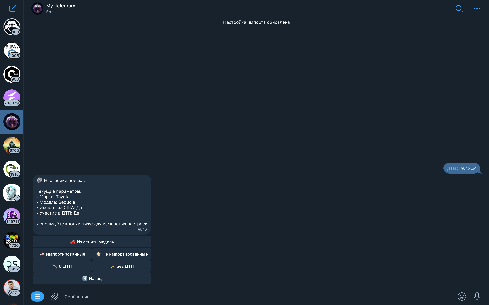

## Default Search Parameters
1. Brand: Toyota
2. Model: Sequoia (can be changed to Tundra or Land Cruiser)
3. Import filter from the USA: Enabled
4. Accident filter: Enabled

## Default Technical Parameters
1. Check interval: 10 minutes
2. Price change notification threshold: $1
3. Timeout on errors: 60 seconds
4. Maximum request retries: 3

## Installation and Setup

### Cloning the Repository
```bash
git clone [repository-url]
cd auto-ria-monitor-bot
```
### Installing Dependencies
```bash
install -r requirements.txt
```

### Configuring the Bot
**Create a .env file in the root directory:**
- BOT_TOKEN=your_telegram_bot_token 
- CHANNEL_ID=your_telegram_channel_id 
- DB_NAME=cars.db # optional, defaults to root directory

### Setting up the Telegram Bot
1. Create a new bot via @BotFather
2. Obtain the bot token
3. Create a Telegram channel
4. Add the bot as an administrator
5. Get the channel ID (via @getidsbot)

## Working with Photos

### Photo Limitations
1. Maximum of 10 photos per album
2. The first photo comes with a caption
3. Pause between albums: 10 seconds
4. Pause after auction photos: 5 seconds

### Photo Formats
- Support for WebP and JPG
- Automatic conversion of previews to full-size images

## Commands and Interface

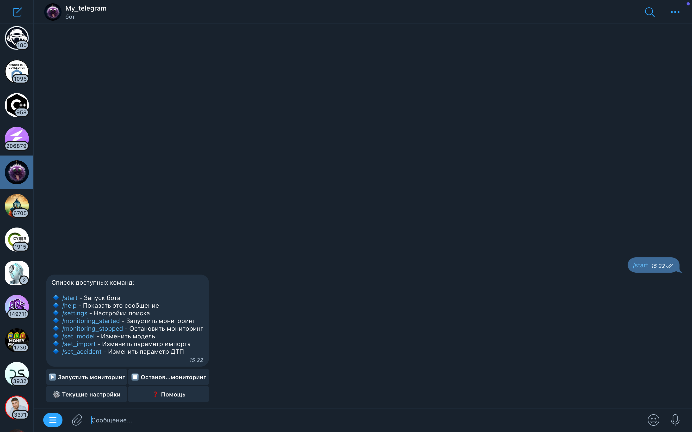

#### Main Commands
**/start** - Start the bot
**/help** - Show the list of commands
**/settings** - Search settings
**/monitoring_started** - Start monitoring
**/monitoring_stopped** - Stop monitoring
**/set_model** - Change the model
**/set_import** - Change the import parameter
**/set_accident** - Change the accident parameter

## Bot Interface

### **Inline navigation buttons:**
1. ▶️ Start monitoring
2. ⏹️ Stop monitoring
3. ⚙️ Current settings
4. ❓ Help

### **Settings Menu**
1. 🚗 Change model
2. 🚢 Imported / 🏠 Not imported
3. 🔧 With accidents / ✨ Without accidents
4. ◀️ Back

## Technical Details

### Parsing a Dynamic Website
1. Using aiohttp for asynchronous requests
2. Proxy support for bypassing restrictions
3. Handling various data formats (HTML, JSON)
4. Automatic detection of photo sources

### Forming the Request URL with Parameters:
**category_id=1** (passenger cars)
**marka_id=79** (Toyota)
**model_id** (depending on the selected model)
**damage** (accident involvement)
**abroad=2** (import from the USA)

### Fetching the HTML Page via aiohttp with Retry Mechanism:
1. 3 attempts with exponential backoff
2. Proxy support (if specified)
3. Error and timeout handling

### Parsing Listings:
1. Extracting ID, title, price, URL
2. Fetching photos via AUTO.RIA API
3. Checking links to auctions

# Not Fully Implemented
### If an Auction Link is Found:
1. Extracting the lot number
2. Parsing photos from Copart/IAAI
3. Adding auction photos to the listing


## Solution Architecture
1. Initializing and launching the bot (bot.py) a) Creating a bot instance with the specified token
   b) Initializing a dispatcher for handling messages
   c) Creating service classes: - Database - for SQLite interactions - TelegramService 
      - for sending messages 
      - CarService 
      - main business logic
   d) Starting polling for updates
   
2. Main Work Cycle (CarService)
    ```bash
    while self.is_running:
        await self.check_updates()
        await asyncio.sleep(check_interval)  # 600 seconds by default
    ```
    **In the check_updates method: 
    a) Retrieve the list of users from the database**
    b) For each user:
      - Load their settings (model, filters)
      - Get current listings via the parser
      - Process new cars, price changes, and sold cars

## Database and Data Storage

**SQLite Table Structure**
1. cars: main listing information
2. price_history: price change history
3. user_settings: user preferences

### Key Database Operations
- Adding new cars
- Updating prices
- Marking cars as sold
- Managing user settings

## Notification System (TelegramService)
1. New Listing
    - Main information (title, price, link)
    - Photo album from AUTO.RIA
    - If available - auction photo album
2. Price Change
    - Old and new price
    - Difference with an emoji indicator
3. Car Sold
    - Information about the sold car
    - Last known price

## Protection Against Blocks and Error Handling
- Delays between requests
- Proxy rotation
- Retry attempts on errors
- Browser-like behavior simulation via User-Agent
- Logging all errors
- Graceful shutdown on stop

## Performance Optimization
- Asynchronous request execution
- Reusing aiohttp sessions
- Caching user settings
- Automatic recovery after failures

## Important Operational Notes
- The bot uses HTML formatting in messages
- Requires access to the Telegram API
- Needs administrator rights in the channel
- Proxy servers are recommended
- The SQLite database must be writable

## Troubleshooting and Recommendations

**Common Issues:**
- "Message not modified" - ignored
- Parsing errors - retry attempt
- Photo issues - skipped and logged

## Maintenance Recommendations
- Regularly check logs
- Set up error notifications
- Use multiple proxy servers
- Monitor Telegram API limits

## Optimal Settings
- Start with monitoring one model
- Set a reasonable price change notification threshold
- Use a dedicated channel for notifications

## Workflow
1. On startup, the bot checks for existing tables in the database
2. Every 10 minutes:
    - Parsing listings from AUTO.RIA
    - Checking for new listings
    - Checking for price changes
    - Checking for sold cars
3. Upon detecting changes:
    - Sending notifications to the channel
    - Updating the database
    - Fetching auction photos (if available)

## Project Structure:
```bash
📁 auto_ria_tracker/                      # Project root directory
│
├── ..env.example                          # Example .env configuration file
├── .gitignore                            # Git ignore list
├── README.md                             # Project documentation
├── README_RUS.md                         # Project documentation in Russian
├── requirements.txt                      # Python dependencies list
├── bot.py                                # Application entry point
├── cars.db                               # SQLite database
├── logger_config.py                      # Logging system configuration
│
├── 📁 config_data/                       # Configuration data
│   ├── __init__.py                       # Package initialization
│   ├── config.py                         # Loading and validating .env variables
│   └── constants.py                      # Project constants
│
├── 📁 database/                          # Database module
│   ├── __init__.py                       # Package initialization
│   └── database.py                       # Class for interacting with SQLite
│
├── 📁 docs/                               # Project documentation
│   └── 📁 images/                           # Images for documentation
│       └── ...                           # Image files
│ 
├── 📁 external_services/                 # External services and APIs
│   ├── __init__.py                       # Package initialization
│   ├── auction_service.py                # Integration with Copart and IAAI auctions
│   └── auto_ria.py                       # Parser and API for auto.ria
│
├── 📁 handlers/                          # Bot command handlers
│   ├── __init__.py                       # Package initialization
│   └── user_handlers.py                  # User command handlers
│
├── 📁 keyboards/                         # Keyboards and buttons
│   ├── __init__.py                       # Package initialization
│   └── main_kb.py                        # Main bot keyboard
│
├── 📁 lexicon/                           # Language resources
│   ├── __init__.py                       # Package initialization
│   └── lexicon_ru.py                     # Russian language texts
│
├── 📁 services/                          # Business logic of the application
│   ├── __init__.py                       # Package initialization
│   ├── car_service.py                    # Car data processing service
│   └── telegram_service.py               # Telegram API service
│
└── 📁 utils/                             # Utility functions
    ├── __init__.py                       # Package initialization
    ├── handlers_utils.py                 # Utilities for command handling
    ├── proxy_manager.py                  # Proxy server management
    └── retry_handler.py                  # Retry handling mechanism
```