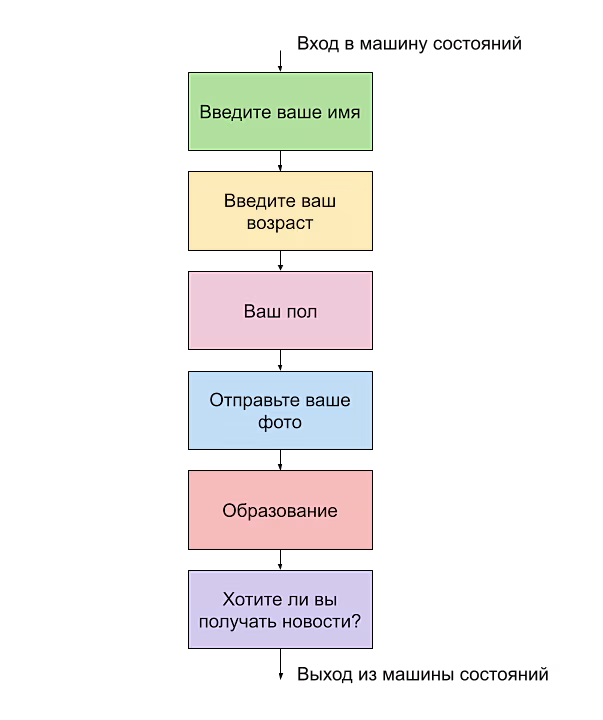

# Developer guide on working with FSM (Finite State Machine) in aiogram:

## Survey Structure:


1. Import necessary classes and objects:
   a) Import StateFilter from aiogram.filters for filtering updates by states.
      ```bash
      from aiogram.filters import StateFilter
      ```

   b) Import FSMContext from aiogram.fsm.context for working with state context.
      Through this class, data about the user's state can be passed to handlers, as well as additional user data
      available in storage (e.g., user's answers sent to the bot in different states).
      ```bash
      from aiogram.fsm.context import FSMContext
      ```

   c) Import default_state, State, StatesGroup from aiogram.fsm.state to define states and state groups.
      The State class represents the user's specific state at a particular moment, while StatesGroup represents a group
      of states logically related.
      ```bash
      from aiogram.fsm.state import default_state, State, StatesGroup
      ```

   d) Choose a storage for state persistence (e.g., MemoryStorage from aiogram.fsm.storage.memory).
      If MemoryStorage is chosen, import it like this:
      ```bash
      from aiogram.fsm.storage.memory import MemoryStorage
      ```
      If Redis is intended as storage, import it like this:
      ```bash
      from aiogram.fsm.storage.redis import RedisStorage
      ```

2. Create a storage for states:
   a) Instantiate the chosen storage (e.g., storage = MemoryStorage()).
   b) Pass the storage to the Dispatcher during its initialization (dp = Dispatcher(storage=storage)).

3. Define a group of states:
   a) Create a class, inherited from StatesGroup, to group related states (e.g., class FSMFillForm(StatesGroup)).
      The name of this class can be anything, but it is desirable that it starts with "FSM" to indicate that this class 
      is related to the state machine. Multiple such classes can exist if multiple state groups are intended. For 
      example, one state group might handle user information input, another might handle bot settings customization, a 
      third might handle interactions with paid subscriptions, a fourth might handle some instructional dialogue to 
      better educate the user on how to interact with the bot, and so on.
   b) Inside the class, create instances of State for each state (e.g., fill_name = State()).
      It's preferable for them to be listed in the same order as the intended transition between them in the bot's
      normal operation.
      ```bash
      class FSMFillForm(StatesGroup):
      
      # ...
      
      fill_name = State()        # State for awaiting name input
      fill_age = State()         # State for awaiting age input
      fill_gender = State()      # State for awaiting gender selection
      upload_photo = State()     # State for awaiting photo upload
      fill_education = State()   # State for awaiting education selection
      fill_wish_news = State()   # State for awaiting news preference selection
      
      # ...
      ```

4. Create handlers for each state:
   a) Use the @dp.message or @dp.callback_query decorator for handlers.
   b) Apply StateFilter to filter updates by states.
   c) Use FSMContext in handlers to manage states and data:
     - await state.set_state(FSMFillForm.fill_name) to set a new state.
     - await state.update_data(name=message.text) to save data in the context.
     - await state.get_data() to retrieve data from the context.
     - await state.clear() to clear the context and exit the FSM.

5. Manage transitions between states:
   a) Check the correctness of data received from the user in handlers.
   b) Upon successful validation, transition the FSM to the next state using await state.set_state(...).
   c) If the data is incorrect, remain in the current state and prompt the user to retry input.

6. Handle exiting the FSM:
   a) Create a handler to process the /cancel command in any state except default_state.
   b) In this handler, clear the context using await state.clear() and take the user out of the FSM.

7. Save user data:
   a) Create a storage (e.g., dictionary) to save user data.
   b) In the handler responsible for the last FSM state, save user data in the storage.

8. Handle messages outside the FSM:
   a) Create handlers to process commands and messages in default_state (outside the FSM).
   b) In these handlers, you can prompt the user to start filling out the survey or perform other actions.

# State filters in handlers.
Typical situations that may arise when working with FSM.

1. Handler should trigger in any state.
   This is the "default" behavior for all handlers. If you don't specify any state filters among the handler's filters,
   the handler will be available in any state, including the default state.

2. Handler should trigger in any state except the default state.
   We want the handler to work inside the state machine but not outside it. This behavior is achieved by inverting the
   default state, meaning we tell the handler to work NOT in the default state - ~StateFilter(default_state)

3. Handler should trigger in a specific state.
   Specify this specific state as the filter - StateFilter(<specific_state>)

4. Handler should trigger in some states.
   Specify these specific states - StateFilter(<specific_state_1>, <specific_state_2>, <specific_state_3>)

5. Handler should trigger in any state except some states.
   Use inversion - ~StateFilter(<specific_state_1>, <specific_state_2>, <specific_state_3>)

6. Handler should trigger in the default state, but not in any other state.
   Specify StateFilter(default_state)

## Note.
Based on this, it's important to remember that if you use a state machine in your bot and want some commands to be
available only in the default state (e.g., the /start command), you need to explicitly specify an additional filter
StateFilter(default_state), otherwise the command will be available in any state.

## Project Structure:
```bash
📁 form_filling_bot_fsm                     # Root directory of the entire project.
 │
 ├── .env                                   # File with environment variables (secret data) for bot configuration.
 │
 ├── .env.example                           # File with examples of secrets for GitHub.
 │
 ├── .gitignore                             # File informing Git about files and directories to ignore.
 │
 ├── bot.py                                 # Main executable file - entry point to the bot.
 │
 ├── requirements.txt                       # File with project dependencies.
 │
 ├── logger_config.py                       # Logger configuration.
 │
 ├── README.md                              # File with project description.
 │
 ├── 📁 content_data/                       # Directory with content for loading into README.md.
 │   └── ...                                # Content for loading into README.md.
 │
 ├── 📁 config_data/                        # Directory with the bot configuration module.
 │   ├── __init__.py                        # Package initializer file. 
 │   └── config_data.py                     # Module for bot configuration.
 │
 ├── 📁 database/                           # Package for working with the database.
 │   ├── __init__.py                        # Package initializer file.     
 │   └── database.py                        # Module with the database template.
 │
 ├── 📁 handlers/                           # Package with handlers.
 │   ├── __init__.py                        # Package initializer file.
 │   └── user_handlers.py                   # Module with user handlers. Main handlers for bot updates.
 │                                              
 ├── 📁 keyboards/                          # Directory for storing keyboards sent to the user.
 │   ├── __init__.py                        # Package initializer file.                      
 │   └── keyboard.py                        # Module with keyboards.
 │                                                 
 ├── 📁 lexicon/                            # Directory for storing bot lexicons.      
 │    ├── __init__.py                       # Package initializer file.                      
 │    └── lexicon.py                        # File with the dictionary mapping commands and queries to displayed texts.
 │ 
 └── 📁 states/                             # Directory for working with FSM states.
    ├── __init__.py                         # Package initializer file. 
    └── states.py                           # Module with FSM state descriptions, defining states and groups.
```
Educational material on Stepik - https://stepik.org/course/120924/syllabus


# Инструкция для разработчика по работе с FSM (конечным автоматом) в aiogram:

## Схема анкеты:


1. Импортируем необходимые классы и объекты:
  a) StateFilter из aiogram.filters для фильтрации апдейтов по состояниям.
  ```bash
  from aiogram.filters import StateFilter
  ```
  b) FSMContext из aiogram.fsm.context для работы с контекстом состояний. 
     Через этот класс можно в хэндлеры передавать данные о состоянии пользователя, а также дополнительные данные 
     пользователя, имеющиеся в хранилище (например, ответы, которые пользователь отправлял боту в разных состояниях).
  ```bash
  from aiogram.fsm.context import FSMContext
  ```
  c) default_state, State, StatesGroup из aiogram.fsm.state для определения состояний и групп состояний.
     Класс State отвечает за конкретное состояние пользователя в конкретный момент времени, а StatesGroup за группу 
     состояний, связанных по смыслу.
  ```bash
  from aiogram.fsm.state import default_state, State, StatesGroup
  ```
  d) Выбираем хранилище для сохранения состояний (например, MemoryStorage из aiogram.fsm.storage.memory).
     Если это MemoryStorage, то импорт такой:
  ```bash
  from aiogram.fsm.storage.memory import MemoryStorage
  ```
  Если в качестве хранилища предполагается использовать, например, Redis, тогда импорт такой:
  ```bash
  from aiogram.fsm.storage.redis import RedisStorage
  ```
2. Создаем хранилище состояний:
    a) Создайте экземпляр выбранного хранилища (например, storage = MemoryStorage()).
    b) Передайте хранилище в Dispatcher при его инициализации (dp = Dispatcher(storage=storage)).
3. Определяем группу состояний:
    a) Создаем класс, наследуемый от StatesGroup, для группировки связанных состояний (например, 
       class FSMFillForm(StatesGroup).
       Название данного класса может быть любым, но желательно, чтобы оно начиналось с "FSM", чтобы было понятно, что 
       данный класс относится к машине состояний. Таких классов может быть несколько, если подразумевается несколько 
       групп состояний. Например, одна группа состояний будет отвечать за то, чтобы пользователь заполнил информацию о 
       себе, вторая группа будет отвечать за кастомизацию настроек бота, третья за работу с какими-нибудь платными 
       подписками, четвертая за какой-нибудь демонстрационный диалог, чтобы обучить пользователя эффективнее 
       взаимодействовать с ботом и так далее.
    b) Внутри класса создаем экземпляры State для каждого состояния (например, fill_name = State()).
       Желательно, что бы они шли по порядку в той же последовательности, в какой планируется переход между ними в боте 
       при штатной работе.
    ```bash
    class FSMFillForm(StatesGroup):
    
    # ...
    
    fill_name = State()        # Состояние ожидания ввода имени
    fill_age = State()         # Состояние ожидания ввода возраста
    fill_gender = State()      # Состояние ожидания выбора пола
    upload_photo = State()     # Состояние ожидания загрузки фото
    fill_education = State()   # Состояние ожидания выбора образования
    fill_wish_news = State()   # Состояние ожидания выбора получать ли новости
    
    # ...
    ```
4. Создаем хэндлеры для каждого состояния:
    a) Используем декоратор @dp.message или @dp.callback_query для хэндлеров.
    b) Применяем фильтр StateFilter для фильтрации апдейтов по состояниям.
    c) В хэндлерах используем FSMContext для управления состояниями и данными:
      - await state.set_state(FSMFillForm.fill_name) для установки нового состояния.
      - await state.update_data(name=message.text) для сохранения данных в контексте.
      - await state.get_data() для получения данных из контекста.
      - await state.clear() для очистки контекста и выхода из FSM.
5. Управляем переходами между состояниями:
    a) В хэндлерах проверяем корректность данных, полученных от пользователя.
    b) При успешной проверке переводим FSM в следующее состояние с помощью await state.set_state(...).
    c) При некорректных данных остаемся в текущем состоянии и предлагаем пользователю повторить ввод.
6. Обрабатываем выход из FSM:
    a) Создаем хэндлер для обработки команды /cancel в любом состоянии, кроме default_state.
    b) В этом хэндлере очищаем контекст с помощью await state.clear() и выводим пользователя из FSM.
7. Сохраняем данные пользователя:
    a) Создаем хранилище (например, словарь) для сохранения данных пользователей.
    b) В хэндлере, обрабатывающем последнее состояние FSM, сохраняем данные пользователя в хранилище.
8. Обрабатываем сообщения вне FSM:
    a) Создаем хэндлеры для обработки команд и сообщений в default_state (вне FSM).
    b) В этих хэндлерах можно предложить пользователю начать заполнение анкеты или выполнять другие действия.

# Фильтры состояний в хэндлерах.
Типовые ситуации, которые могут возникнуть при работе с FSM.

1. Хэндлер должен срабатывать в любых состояниях.
   Это поведение "по умолчанию" для всех хэндлеров. То есть если вы не укажете среди фильтров для хэндлера никаких 
   фильтров состояний - хэндлер будет доступен в любом состоянии, включая состояние "по умолчанию".
2. Хэндлер должен срабатывать в любых состояниях, кроме состояния "по умолчанию".
   То есть мы хотим, чтобы хэндлер работал внутри машины состояний, но не работал вне ее. Такое поведение достигается 
   через инверсию дефолтного состояния, то есть мы говорим хэндлеру работать НЕ в дефолтном состоянии - 
   ~StateFilter(default_state)
3. Хэндлер должен срабатывать в конкретном состоянии.
   Нужно указать в качестве фильтра это конкретное состояние - StateFilter(<конкретное_состояние>)
4. Хэндлер должен срабатывать в некоторых состояниях.
   Нужно указать эти конкретные состояния - StateFilter(<конкретное_состояние_1>, <конкретное_состояние_2>, 
   <конкретное_состояние_3>)
5. Хэндлер должен срабатывать в любых состояниях, кроме некоторых.  
   Используем инверсию - ~StateFilter(<конкретное_состояние_1>, <конкретное_состояние_2>, <конкретное_состояние_3>)
6. Хэндлер должен срабатывать в состоянии по умолчанию, а в любых других состояниях нет.
   Указываем в качестве фильтра StateFilter(default_state)

## Примечание. 
Исходя из этого, нужно помнить, что если мы используем в нашем боте машину состояний и хотите, чтобы некоторые команды 
были доступны только в состоянии по умолчанию (например, команда /start) - нужно явно указывать дополнительный фильтр 
StateFilter(default_state), иначе команда будет доступна вообще в любом состоянии.


## Структура проекта:
```bash
📁 form_filling_bot_fsm                     # Корневая директория всего проекта.
 │
 ├── .env                                   # Файл с переменными окружения (секретными данными) для конфигурации бота.
 │
 ├── .env.example                           # Файл с примерами секретов для GitHub.
 │
 ├── .gitignore                             # Файл, сообщающий гиту какие файлы и директории не отслеживать.
 │
 ├── bot.py                                 # Основной исполняемый файл - точка входа в бот.
 │
 ├── requirements.txt                       # Файл с зависимостями проекта.
 │
 ├── logger_config.py                       # Конфигурация логгера.
 │
 ├── README.md                              # Файл с описанием проекта.
 │
 ├── 📁 conеtent_data/                      # Директория с контентом для загрузки в README.md.
 │   └── ...                                # Контентом для загрузки в README.md.
 │
 ├── 📁 config_data/                        # Директория с модулем конфигурации бота.
 │   ├── __init__.py                        # Файл-инициализатор пакета. 
 │   └── config_data.py                     # Модуль для конфигурации бота.
 │
 ├── 📁 database/                           # Пакет для работы с базой данных.
 │   ├── __init__.py                        # Файл-инициализатор пакета.     
 │   └── database.py                        # Модуль с шаблоном базы данных.
 │
 ├── 📁 handlers/                           # Пакет с обработчиками.
 │   ├── __init__.py                        # Файл-инициализатор пакета.
 │   └── user_handlers.py                   # Модуль с обработчиками пользователя. Основные обработчики обновлений бота.
 │                                              
 ├── 📁 keyboards/                          # Директория для хранения клавиатур отправляемые пользователю.
 │   ├── __init__.py                        # Файл-инициализатор пакета.                      
 │   └── keyboard.py                        # Модуль с клавиатурами.
 │                                                 
 ├── 📁 lexicon/                            # Директория для хранения словарей бота.      
 │    ├── __init__.py                       # Файл-инициализатор пакета.                      
 │    └── lexicon.py                        # Файл со словарем соответствий команд и запросов отображаемым текстам.
 │ 
 └── 📁 states/                             # Директория для работы с состояниями FSM.
    ├── __init__.py                         # Файл-инициализатор пакета. 
    └── states.py                           # Модуль с описанием состояний FSM, здесь определяются состояния и группы.
 ```
Учебный материал на Stepik - https://stepik.org/course/120924/syllabus