# Formatting text in messages

## Telegram supports three text formatting methods:
- HTML style
- Markdown style
- MarkdownV2 style
Note that support for Markdown style starting from the third version of aiogram is not planned.

To enable support for the required style, you need to either specify the parse_mode parameter in each sent message, or 
do it once during the bot initialization stage. The second method is preferable because it requires less code, but it's 
also important to know about the first one, just in case.

## Here are examples:
1) Specifying the parse_mode parameter in each sent message.
```bash
# This handler will respond to the command "/html"
@dp.message(Command(commands='html'))
async def process_html_command(message: Message):
    await message.answer(
        text='This is a text demonstrating '
             'how HTML markup works:\n\n'
             '<b>This is bold text</b>\n'
             '<i>This is italic text</i>\n'
             '<u>This is underlined text</u>\n'
             '<span class="tg-spoiler">And this is a spoiler</span>\n\n'
             'To see the list of available commands again - '
             'send the command /help',
        parse_mode='HTML'
    )
```
2. Here, we don't specify the parse_mode parameter in each sent message, but do it once during
the bot object initialization.
```bash
bot: Bot = Bot(token=config.bot_token.get_secret_value(), default=DefaultBotProperties(parse_mode='HTML'))
# or 
bot: Bot = Bot(BOT_TOKEN, parse_mode='HTML')
```
### Here's how the markup might look like:
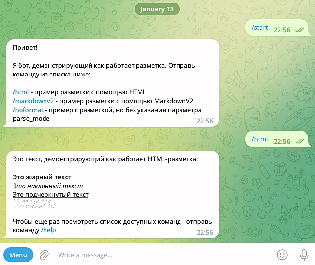


## Currently supported HTML tags are:

1. <b>Bold text</b> or <strong>Bold text</strong>
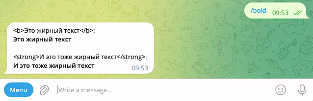

2. <i>Italic text</i> or <em>Italic text</em>
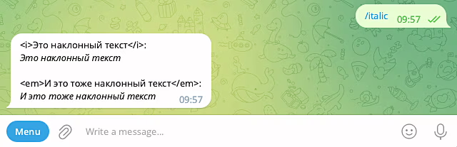

3. <u>Underlined text</u> or <ins>Underlined text</ins>
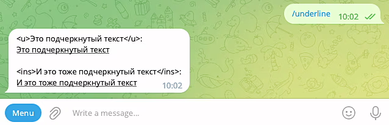

4. <s>Strikethrough text</s> or <strike>Strikethrough text</strike>, <del>Strikethrough text</del>
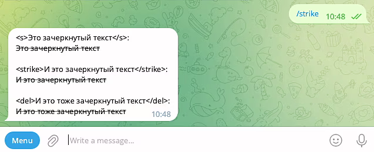

5. <span class="tg-spoiler">Spoiler</span> or <tg-spoiler>Spoiler</tg-spoiler>
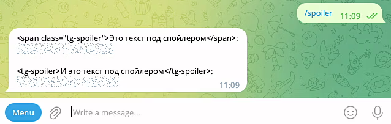

6. <a href="https://stepik.org/120924">External link</a>


7. <a href="tg://user?id=173901673">Internal link</a>
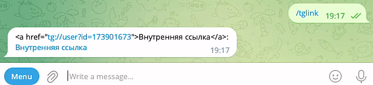

8. <code>Monospaced text</code> - this text becomes copyable with a single click on it.
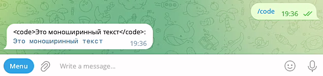

9. <pre>Preformatted text</pre>
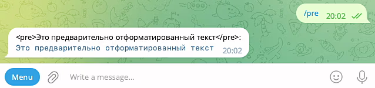

10. <pre><code class="language-python">Preformatted code block in Python language</code></pre>
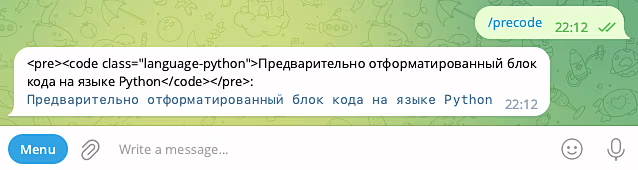

#### The difference between <pre> and <code> tags is not quite obvious from the screenshots above. It's better noticed 
#### if you insert these tags inside a continuous sentence. The <pre> tag highlights the text in a separate block, while 
#### the <code> tag remains part of the line, not breaking it. Also, with <code>, this text becomes copyable with a 
#### single click on it.
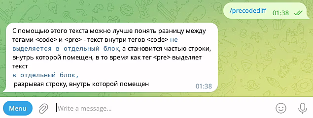

#### You can also combine some tags by nesting them. For example:
   a)<b><i>Bold italic text</i></b>
   b) <i><u>Italic underlined text</u></i>
   c) <b><i><u>Bold italic underlined text</u></i></b>

#### If parse_mode='HTML' is enabled and we need characters like "<", ">", "&" to be displayed in the text, i.e., so 
#### that Telegram does not interpret them as part of HTML markup, they need to be replaced with corresponding entities:
   a) < - replaced with <
   b) > - replaced with >
   c) & - replaced with &

## MarkdownV2 supports the following markup:

1. *Bold text*
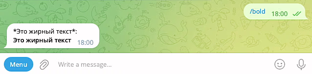

2. _Italic text_
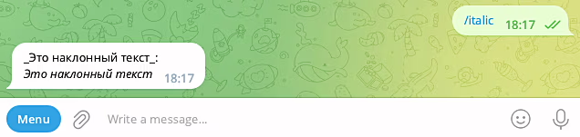

3. __Underlined text__
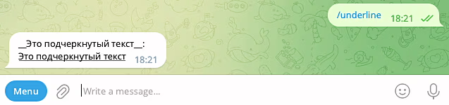

4. ~Strikethrough text~
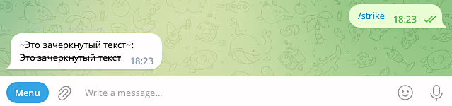

5. ||Spoiler||
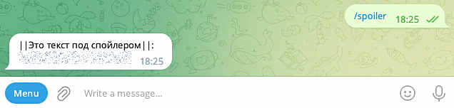

6. [External link](https://stepik.org/120924)
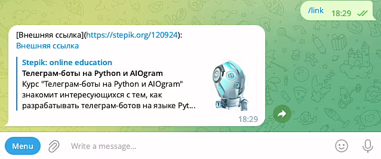

7. [Internal link](tg://user?id=173901673)
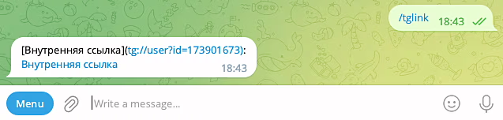

8. `Monospaced text`
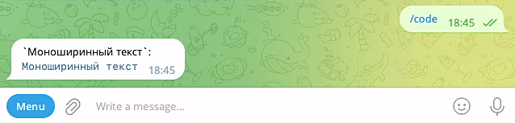

9. ```
   Preformatted text
   ```
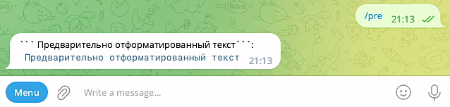

10. ```python 
    Preformatted code block in Python language
    ```
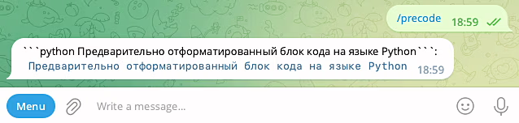

#### Just like with HTML markup, you can combine some formatting methods in MarkdownV2:
   a) Bold italic text
   b) Italic underlined text\r
   c) Bold italic underlined text\r

#### Note 1.
When working in MarkdownV2 mode, characters that should not be interpreted by Telegram as part of markup need to be 
escaped with a '' character.
Such characters as '_', '*', '[', ']', '(', ')', '~', '`', '>', '#', '+', '-', '=', '|', '{', '}', '.', '!' need to be 
escaped with '' and other restrictions.

#### Note 2.
In cases where text needs to be both italicized and underlined simultaneously, the seemingly logical formatting like
Italic underlined text will result in an error. You need to add a special '\r' symbol after the first underscore at the
end of the formatted text. So the correct way would be Italic underlined text\r.

## Emoji 😝😱🤪- can be found, for example, at:
https://www.unicode.org/emoji/charts/full-emoji-list.html
https://symbl.cc/ru/
https://getemoji.com/


## Project Structure:
```bash
📁 formatting_text_in_messages              # Root directory of the project
 │
 ├── .env                                   # File with environment variables (secret data) for bot configuration.
 │
 ├── .env.example                           # File with secret examples for GitHub
 │
 ├── .gitignore                             # File telling git which files and directories to ignore
 │
 ├── bot.py                                 # Main executable file - entry point for the bot
 │
 ├── requirements.txt                       # File with project dependencies.
 │
 ├── logger_config.py                       # Logger configuration.
 │
 ├── README.md                              # File with project description.
 │
 ├── 📁 images_for_readme/                  # Directory for storing images for use in README.md.         
 │   └── ...                                # Image used in README.md
 │
 ├── 📁 config_data/                        # Package with bot configuration module.
 │   ├── __init__.py                        # Package initializer file. 
 │   └── config_data.py                     # Module for bot configuration.
 │
 ├── 📁 handlers/                           # Package with handlers.
 │   ├── __init__.py                        # Package initializer file.
 │   └── user_handlers.py                   # Module with user handlers. Main update handlers of the bot.
 │                                                 
 └── 📁 lexicon/                            # Directory for storing bot lexicons.      
     ├── __init__.py                        # Package initializer file.                      
     └── lexicon.py                         # File with command-to-text mapping lexicon.
```
Educational material on Stepik - https://stepik.org/course/120924/syllabus


# Форматирование текста в сообщениях

## Telegram поддерживает три способа разметки текста:
- HTML style
- Markdown style
- MarkdownV2 style
При этом поддержка Markdown style, начиная с третьей версии aiogram, не планируется.

Чтобы включить поддержку требуемого стиля, надо либо в каждом отправляемом сообщении указывать параметр parse_mode, либо 
сделать это один раз на этапе инициализации бота. Второй способ, конечно, предпочтительнее, потому что требует написания
меньшего количества кода, но и про первый нужно знать, мало ли какие ситуации могут быть.

Вот примеры:
1) В каждом отправляемом сообщении указываем параметр parse_mode.
```bash
# Этот хэндлер будет срабатывать на команду "/html"
@dp.message(Command(commands='html'))
async def process_html_command(message: Message):
    await message.answer(
        text='Это текст, демонстрирующий '
             'как работает HTML-разметка:\n\n'
             '<b>Это жирный текст</b>\n'
             '<i>Это наклонный текст</i>\n'
             '<u>Это подчеркнутый текст</u>\n'
             '<span class="tg-spoiler">А это спойлер</span>\n\n'
             'Чтобы еще раз посмотреть список доступных команд - '
             'отправь команду /help',
        parse_mode='HTML'
    )
```
2) Здесь мы уже не указываем параметр parse_mode в каждом отправляемом сообщении, а делаем это один раз при 
   инициализации объекта бота.
```bash
bot: Bot = Bot(token=config.bot_token.get_secret_value(), default=DefaultBotProperties(parse_mode='HTML'))
# или 
bot: Bot = Bot(BOT_TOKEN, parse_mode='HTML')
```

### Вот как может выглядить разметка:


## На текущий момент поддерживаются следующие HTML-теги:

1. <b>Жирный текст</b> или то же самое <strong>Жирный текст</strong>


2. <i>Наклонный текст</i> или то же самое <em>Наклонный текст</em>


3. <u>Подчеркнутый текст</u> или то же самое <ins>Подчеркнутый текст</ins>


4. <s>Перечеркнутый текст</s> или то же самое <strike>Перечеркнутый текст</strike>, <del>Перечеркнутый текст</del>


5. <span class="tg-spoiler">Спойлер</span> или то же самое <tg-spoiler>Спойлер</tg-spoiler>


6. <a href="https://stepik.org/120924">Внешняя ссылка</a>


7. <a href="tg://user?id=173901673">Внутренняя ссылка</a>


8. <code>Это моноширинный текст</code> - этот текст становится копируемым при одном нажатии на него.


9. <pre>Предварительно отформатированный текст</pre>


10. <pre><code class="language-python">Предварительно отформатированный блок кода на языке Python</code></pre>


#### Разница между тегами <pre> и <code> не совсем очевидна из скриншотов выше. Она лучше заметна, если вставить эти 
#### теги внутрь цельного предложения. Тег <pre> выделяет текст в отдельный блок, а тег <code> остается частью строки, 
#### не разрывая ее. Также при помощи <code>, этот текст становится копируемым при одном нажатии на него.


#### Также можно комбинировать некоторые теги, помещая одни внутрь других. Например:
   a)<b><i>Жирный наклонный текст</i></b>
   b) <i><u>Наклонный подчеркнутый текст</u></i>
   с) <b><i><u>Жирный наклонный подчеркнутый текст</u></i></b>

#### Если включен parse_mode='HTML' и при этом нам нужно, чтобы в тексте отображались символы "<", ">", "&", то есть, 
#### чтобы телеграм не принимал их за часть HTML-разметки, их нужно заменить соответствующими объектами:
   a) < - заменяется на &lt;
   b) > - заменяется на &gt;
   с) & - заменяется на &amp;

## В MarkdownV2 поддерживается следующая разметка:

1. *Жирный текст*


2. _Наклонный текст_


3. __Подчеркнутый текст__


4. ~Перечеркнутый текст~


5. ||Спойлер||


6. [Внешняя ссылка](https://stepik.org/120924)


7. [Внутренняя ссылка](tg://user?id=173901673)


8. `Моноширинный текст`


9. ```
   Предварительно отформатированный текст
   ```


10. ```python 
    Предварительно отформатированный блок кода на языке Python 
    ```


#### Так же, как и в случае с HTML-разметкой, можно комбинировать некоторые способы разметки в MarkdownV2
   a) *_Жирный наклонный текст_*
   b) ___Наклонный подчеркнутый текст_\r__
   с) *___Жирный наклонный подчеркнутый текст_\r__*

#### Примечание 1. 
Символы при работе в режиме MarkdownV2, которые не должны восприниматься телеграмом как часть разметки, должны быть 
экранированы символом '\'
Такие символы как '_', '*', '[', ']', '(', ')', '~', '`', '>', '#', '+', '-', '=', '|', '{', '}', '.', '!' должны быть 
экранированы '\' и другие ограничения.

#### Примечание 2. 
В случае, когда текст должен быть написан курсивом и подчеркнут одновременно, кажущееся логичным форматирование вида 
___Наклонный подчеркнутый текст___ будет приводить к ошибке. Необходимо добавить специальный символ '\r' после первого 
подчеркивания в конце форматированного текста. То есть правильным вариантом будет ___Наклонный подчеркнутый текст_\r__.

## Emoji 😝😱🤪- можно найти, например:
1) https://www.unicode.org/emoji/charts/full-emoji-list.html
2) https://symbl.cc/ru/
3) https://getemoji.com/


## Структура проекта:
```bash
📁 formatting_text_in_messages              # Корневая директория всего проекта
 │
 ├── .env                                   # Файл с переменными окружения (секретными данными) для конфигурации бота.
 │
 ├── .env.example                           # Файл с примерами секретов для GitHub
 │
 ├── .gitignore                             # Файл, сообщающий гиту какие файлы и директории не отслеживать
 │
 ├── bot.py                                 # Основной исполняемый файл - точка входа в бот
 │
 ├── requirements.txt                       # Файл с зависимостями проекта.
 │
 ├── logger_config.py                       # Конфигурация логгера.
 │
 ├── README.md                              # Файл с описанием проекта.
 │
 ├── 📁 images_for_readme/                  # Директория для хранения изображений для использования в README.md.         
 │   └── ...                                # Изображение, используемое в README.md
 │
 ├── 📁 config_data/                        # Директория с модулем конфигурации бота.
 │   ├── __init__.py                        # Файл-инициализатор пакета. 
 │   └── config_data.py                     # Модуль для конфигурации бота.
 │
 ├── 📁 handlers/                           # Пакет с обработчиками.
 │   ├── __init__.py                        # Файл-инициализатор пакета.
 │   └── user_handlers.py                   # Модуль с обработчиками пользователя. Основные обработчики обновлений бота.
 │                                                 
 └── 📁 lexicon/                            # Директория для хранения словарей бота.      
     ├── __init__.py                        # Файл-инициализатор пакета.                      
     └── lexicon.py                         # Файл со словарем соответствий команд и запросов отображаемым текстам.
 ```
Учебный материал на Stepik - https://stepik.org/course/120924/syllabus