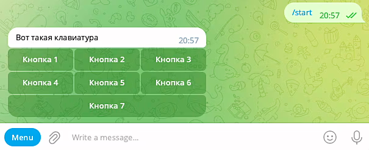
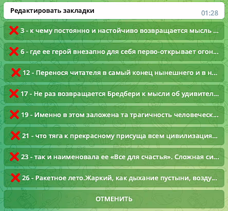

# This is a Telegram bot using the aiogram library to demonstrate working with callback inline buttons.

## Features:
- Utilizes the aiogram routing system to register event handlers.
- Implements handlers for the /start command and pressing two inline buttons.
- Buttons and texts are stored in a separate lexicon.py file for easy multilingual support.
- Custom logger is configured with colorful log level markup.
- Pydantic library is used for storing and validating configuration data.
- Bot configuration data (bot token) is loaded from the .env file.

Overall, this is a demonstration project for exploring the capabilities of inline callback buttons in aiogram using 
recommended practices.

**Callback buttons** - perhaps the most commonly used type of inline buttons in Telegram bots, greatly expanding the 
messenger's capabilities. Their operation boils down to the fact that when such a button is pressed, an update is 
received containing the data field. Separate handlers can be configured for updates with such attributes, which can 
launch virtually any scenario.

## Principles of working with inline buttons with callback_data parameter:

1. Create inline buttons with the text to be displayed on the button and the text in callback_data, which will come in 
   the CallbackQuery update in the data field.
2. Create an inline keyboard object and add an array of button arrays to it.
3. Send the inline keyboard together with the message text to the user (reply_markup parameter).
4. Using the callback_query method of the dispatcher (router), capture updates of type CallbackQuery, filter them by the
   data field, and direct them to the corresponding handler.
5. In the handler, either modify the message (text and/or buttons) or send an empty callback.answer() response to 
   prevent the user from feeling that the bot is stuck in thought.
6. Repeat from the beginning - as many times as necessary.

*Note 1.* The text in the callback_data parameter can be up to 64 bytes in size.

*Note 2.* We use the callback.answer() instruction to inform Telegram that we have accepted and processed the callback.
Just in case, I'll clarify that callback here is an instance of the CallbackQuery class that enters the handlers, so it 
doesn't necessarily have to be named callback. We call it that for convenience when describing the handler. Nothing 
prevents us from naming it something else, and when you study the code of other developers' bots, you will encounter 
other names for this parameter. For example, call or cb, or clbck, etc.

*Note 3.* Sometimes it happens that everything seems to be done correctly: messages with buttons are displayed, handlers
for callbacks are configured, but the bot doesn't react to user button presses. That is, the buttons are pressed, but 
the bot does not receive updates. If you encounter such a situation, then perhaps the solution lies here:

    The most common reason for this behavior is restrictions in your bot on the types of allowed updates. To check which
    updates are allowed in your bot, you need to refer to the getWebhookInfo method. This can be done either by sending 
    a request to the Telegram servers through the browser line, with the bot backend turned off:
    ```bash
    https://api.telegram.org/bot<BOT_TOKEN>/getWebhookInfo
    ```
     or directly in your bot's code:
    ```bash
    print(await bot.get_webhook_info())
    ```
     If the response looks like this:
    ```bash
    {
      "ok": true,
      "result": {
        "url": "",
        "has_custom_certificate": false,
        "pending_update_count": 0
      }
    }
    ```
    then the issue is not with the allowed updates but with something else. If the response looks like this:
    ```bash
    {
      "ok": true,
      "result": {
        "url": "",
        "has_custom_certificate": false,
        "pending_update_count": 0,
        "allowed_updates": [
          "message"
        ]
      }
    }
    ```
    then under the "allowed_updates" key, there will be a list of update types. This means that Telegram will only pass 
    you updates of these types upon request.

When a user clicks on an inline button, the bot receives a callback request containing information about the click. To 
respond to such a request, the **answer** method of the callback object is used. This method can take additional 
parameters, such as:
- text - responsible for the text of the popup notification or alert window (up to 200 characters)
- show_alert - responsible for turning the popup notification window into an alert requiring closure, if set to True. 
  Default is False.
- url - a link that will be opened by the user's client (only specific types of links are supported)
- cache_time - responsible for the maximum time (in seconds) to cache the callback query result for the user's client.

1. To notify the user of a button press, you can use the following code:
    ```bash
    await callback.answer(text='Hooray! Button 1 pressed')
    ```
    *The popup window with the text from the text parameter appears for a few seconds and then disappears.* This is 
    convenient for notifying
    the user that some action related to pressing the button has been performed without overloading the bot interface.

2. Let's add the show_alert parameter to the handler that triggers when the first button is pressed, and set it to True 
   to create an alert:
    ```bash
    await callback.answer(text='Hooray! Button 1 pressed', show_alert=True)
    ```
    *Now, instead of a popup window with a notification, an alert requiring user confirmation will appear.* This can be 
    useful when
    you need to draw the user's attention to ensure that they do not miss an important notification from the bot.

### Project Structure:
```bash
 📁 improved_echo_bot/                             # Project directory, main bot file.
 │
 ├── .env                                          # Configuration file with secrets.
 │
 ├── .env.example                                  # File with example secrets for GitHub.
 │
 ├── .gitignore                                    # File informing git which files and directories to ignore.
 │
 ├── bot.py                                        # Main executable file - entry point to the bot.
 │
 ├── requirements.txt                              # File with project dependencies.
 │
 ├── logger_config.py                              # Logger configuration.
 │
 ├── README.md                                     # Project description file.
 │
 ├── 📁 images_for_readme/                         # Directory for storing images for use in README.md.     
 │   ├── example_1.png                             # Example image 1.
 │   ├── example_2.png                             # Example image 2.
 │   └── example_3.png                             # Example image 3.
 │ 
 ├── 📁 config_data/                               # Directory with the bot configuration module.
 │   ├── __init__.py                               # Package initializer file.
 │   └── config_data.py                            # Module for bot configuration.
 │ 
 ├── 📁 handlers/                                  # Directory with handlers.
 │   ├── __init__.py                               # Package initializer file.
 │   └── user_handlers.py                          # Module with user update handlers.
 │                                              
 ├── 📁 keyboards/                                 # Directory to store keyboards sent to users.
 │   ├── __init__.py                               # Package initializer file.                      
 │   └── keyboards.py                              # Module with keyboards.
 │ 
 └── 📁 lexicon/                                   # Directory to store bot dictionaries.
     ├── __init__.py                               # Package initializer file.            
     └── lexicon_ru.py                             # Module with command-to-text mappings.
```
Educational material on Stepik - https://stepik.org/course/120924/syllabus


# Это бот для Telegram с использованием библиотеки aiogram для демонстрации работы с inline-кнопками типа callback.

## Особенности:
- Используется система маршрутизации aiogram для регистрации обработчиков событий.
- Реализованы обработчики для команды /start и для нажатия на две inline-кнопки.
- Кнопки и тексты хранятся в отдельном файле lexicon.py для удобства поддержки мультиязычности.
- Настроен кастомный логгер с цветной разметкой логов разных уровней.
- Используется библиотека pydantic для хранения и валидации конфигурационных данных.
- Конфигурационные данные (токен бота) загружаются из файла .env.

В целом, это демонстрационный проект для изучения возможностей inline-кнопок callback в aiogram с применением 
рекомендуемых практик.

**Callback-кнопки** - это, наверное, самый часто используемый вид инлайн-кнопок в телеграм-ботах, который очень сильно 
расширяет возможности мессенджера. Суть их работы сводится к тому, что при нажатии на такую кнопку приходит апдейт, в 
котором есть поле data. На апдейты с такими атрибутами можно настроить отдельные хэндлеры, которые будут запускать 
буквально любые сценарии.

## Принципы работы с инлайн-кнопками с параметром callback_data:

1. Создаем инлайн-кнопки с текстом, который будет отображаться на кнопке, и текстом в callback_data, который будет 
   приходить в апдейте типа CallbackQuery в поле data.
2. Создаем объект инлайн-клавиатуры и добавляем в него массив массивов кнопок.
3. Отправляем инлайн-клавиатуру вместе с текстом сообщения пользователю (параметр reply_markup).
4. Методом callback_query у диспетчера (роутера) ловим апдейт типа CallbackQuery, фильтруем его по полю data и 
   направляем в соответствующий хэндлер.
5. В хэндлере либо модифицируем сообщение (текст и/или кнопки), либо отправляем пустой ответ callback.answer(), чтобы у
   пользователя не было ощущения, что бот завис в задумчивости.
6. Повторяем сначала - столько раз, сколько необходимо.

*Примечание 1.* Текст в параметре callback_data может быть размером до 64 байтов.

*Примечание 2.* Мы пользуемся инструкцией callback.answer(), чтобы сообщить телеграму о том, что мы приняли callback и 
обработали его. На всякий случай уточню, что callback здесь - это экземпляр класса CallbackQuery, который попадает в 
хэндлеры, то есть он не обязательно должен называться именно callback. Это мы его так называем для удобства, когда 
описываем работу хэндлера. Никто не мешает нам назвать его как-то по-другому и, когда вы будете изучать код ботов других 
разработчиков - вы будете встречать другие названия этого параметра. Например, call или cb, или clbck и т.п.

*Примечание 3.* Иногда случается так, что, вроде, все сделано правильно: и сообщения с кнопками выводятся, и хэндлеры на 
коллбэки настроены, а бот почему-то не реагирует на нажатия кнопок пользователями. То есть, кнопки нажимаются, а апдейты
боту не приходят. Если вы столкнулись с подобной ситуацией, то, возможно, решение лежит здесь:

    Самая частая причина такого поведения - это ограничения в вашем боте на типы разрешенных апдейтов. Чтобы проверить 
    какие апдейты разрешены в вашем боте - нужно обратиться к методу getWebhookInfo. Сделать это можно либо отправив 
    запрос к серверам телеграм через строку браузера, при выключенном бэкэнде бота:
    ```bash
    https://api.telegram.org/bot<BOT_TOKEN>/getWebhookInfo
    ```
     либо напрямую в коде вашего бота:
    ```bash
    print(await bot.get_webhook_info())
    ```
     Если ответ приходит вида:
    ```bash
    {
      "ok": true,
      "result": {
        "url": "",
        "has_custom_certificate": false,
        "pending_update_count": 0
      }
    }
    ```
    тогда дело не в разрешенных апдейтах, а в чем-то другом. Если же ответ похож на такой:
    ```bash
    {
      "ok": true,
      "result": {
        "url": "",
        "has_custom_certificate": false,
        "pending_update_count": 0,
        "allowed_updates": [
          "message"
        ]
      }
    }
    ```
    то есть по ключу "allowed_updates" будет список с типами апдейтов, значит, апдейты только этих типов телеграм будет 
    передавать вам по запросу.

Когда пользователь нажимает на inline-кнопку, бот получает callback-запрос, который содержит информацию о нажатии. Для 
ответа на такой запрос используется метод **answer** объекта callback. Этот метод может принимать дополнительные 
параметры, такие как:
- text - отвечает за текст всплывающего на пару секунд окна нотификации или алерта (до 200 символов)
- show_alert - отвечает за превращение всплывающего и самостоятельно исчезающего окошка нотификации в алерт, требующий 
  закрытия, если установить равным True. По умолчанию - False.
- url - ссылка, которая будет открыта клиентом пользователя (поддерживаются не любые ссылки, а только специфические)
- cache_time - отвечает за максимальное время (в секундах) кэширования результата запроса обратного вызова клиентом 
  пользователя.

1. Чтобы уведомить пользователя о нажатии кнопки, можно использовать следующий код:
    ```bash
    await callback.answer(text='Ура! Нажата кнопка 1')
    ```
    *Всплывающее окно с текстом из параметра text появляется на несколько секунд и затем исчезает.* Это удобно для 
    уведомления
    пользователя о выполнении какого-либо действия, связанного с нажатием кнопки, не перегружая интерфейс бота.

2. Добавим параметр show_alert к хэндлеру, срабатывающему на нажатие первой кнопки, и установим его равным True, чтобы 
    создать алерт:
    ```bash
    await callback.answer(text='Ура! Нажата кнопка 1', show_alert=True)
    ```
    *Теперь вместо всплывающего окна с нотификацией появится алерт, который требует подтверждения пользователя.* Это 
    может быть полезно, когда необходимо привлечь внимание пользователя, чтобы он не пропустил важное уведомление от 
    бота.

## При использовании инлайн-кнопок, мы можем формировать callback_data вручную, либо получая заранее заготовленные 
## данные из словаря соответствий LEXICON, что по сути, тоже почти вручную:

### Пример 1. Хардкодим текст и callback_data кнопок:
```bash
# Создаем объекты инлайн-кнопок

# Создаем первую большую кнопку с текстом 'БОЛЬШАЯ КНОПКА 1' и callback_data 'big_button_1_pressed'
big_button_1 = InlineKeyboardButton(text='БОЛЬШАЯ КНОПКА 1', callback_data='big_button_1_pressed')  

# Создаем вторую большую кнопку с текстом 'БОЛЬШАЯ КНОПКА 2' и callback_data 'big_button_2_pressed'
big_button_2 = InlineKeyboardButton(text='БОЛЬШАЯ КНОПКА 2', callback_data='big_button_2_pressed')  
```


### Пример 2. Подставляем значения из словаря соответствий:
```bash
# Определяем словарь LEXICON, где ключи - это идентификаторы кнопок, а значения - текст, отображаемый на кнопках
LEXICON: dict[str, str] = {
    'but_1': 'Кнопка 1',  
    'but_2': 'Кнопка 2',
    'but_3': 'Кнопка 3',
    'but_4': 'Кнопка 4',
    'but_5': 'Кнопка 5',
    'but_6': 'Кнопка 6',
    'but_7': 'Кнопка 7'
}
# Создаем пустой список для хранения объектов инлайн-кнопок
buttons: list[InlineKeyboardButton] = [] 

# Проходимся по элементам словаря LEXICON
for button, text in LEXICON.items():
    # Создаем объекты инлайн-кнопок с текстом и callback_data, используя значения из словаря добавляя их в список кнопок
    buttons.append(InlineKeyboardButton(text=text, callback_data=button))  
```


### Пример 3. Задаем сложное правило для формирования инлайн-кнопок
```bash
# Создаем экземпляр InlineKeyboardBuilder для построения клавиатуры
kb_builder = InlineKeyboardBuilder()
# Наполняем клавиатуру кнопками-закладками в порядке возрастания
# Проходим по кнопкам в отсортированном порядке
for button in sorted(args):
    # Создаем кнопку с текстом, содержащим идентификатор кнопки, краткое содержание текста и кнопку для удаления этой
    # закладки, затем добавляем ее в текущую строку клавиатуры
    kb_builder.row(InlineKeyboardButton(
        # Текст кнопки включает символ удаления, идентификатор кнопки, а также краткий текст книги
        text=f'{LEXICON["del"]} {button} - {book[button][:100]}',
        # Устанавливаем callback_data для кнопки удаления
        callback_data=f'{button}del'))
# Добавляем в конец клавиатуры кнопку "Отменить", которая будет доступна в любом случае
kb_builder.row(InlineKeyboardButton(
    # Устанавливаем текст кнопки "Отменить" из словаря LEXICON
    text=LEXICON['cancel'],
    # Устанавливаем callback_data для кнопки "Отменить"
    callback_data='cancel'))
```



### Структура проекта:
```bash
 📁 improved_echo_bot/                             # Директория проекта, основной файл бота.
 │
 ├── .env                                          # Файл с конфигурацией и секретами.
 │
 ├── .env.example                                  # Файл с примерами секретов для GitHub
 │
 ├── .gitignore                                    # Файл, сообщающий гиту какие файлы и директории не отслеживать
 │
 ├── bot.py                                        # Основной исполняемый файл - точка входа в бот
 │
 ├── requirements.txt                              # Файл с зависимостями проекта.
 │
 ├── logger_config.py                              # Конфигурация логгера.
 │
 ├── README.md                                     # Файл с описанием проекта.
 │
 ├── 📁 images_for_readme/                         # Директория для хранения изображений для использования в README.md.     
 │   ├── example_1.png                             # Пример изображения 1.
 │   ├── example_2.png                             # Пример изображения 2.
 │   └── example_3.png                             # Пример изображения 3.
 │
 ├── 📁 config_data/                               # Директория с модулем конфигурации бота.
 │   ├── __init__.py                               # Файл-инициализатор пакета. 
 │   └── config_data.py                            # Модуль для конфигурации бота.
 │ 
 ├── 📁 handlers/                                  # Директория с хэндлерами.
 │   ├── __init__.py                               # Файл-инициализатор пакета.
 │   └── user_handlers.py                          # Модуль с обработчиками апдейтов от пользователя.
 │                                              
 ├── 📁 keyboards/                                 # Директория для хранения клавиатур отправляемые пользователю.
 │   ├── __init__.py                               # Файл-инициализатор пакета.                      
 │   └── keyboards.py                              # Модуль с клавиатурами.
 │ 
 └── 📁 lexicon/                                   # Директория для хранения словарей бота.
     ├── __init__.py                               # Файл-инициализатор пакета.            
     └── lexicon_ru.py                             # Модуль со словарем соответствий команд и отображаемых текстов.
 ```
Учебный материал на Stepik - https://stepik.org/course/120924/syllabus