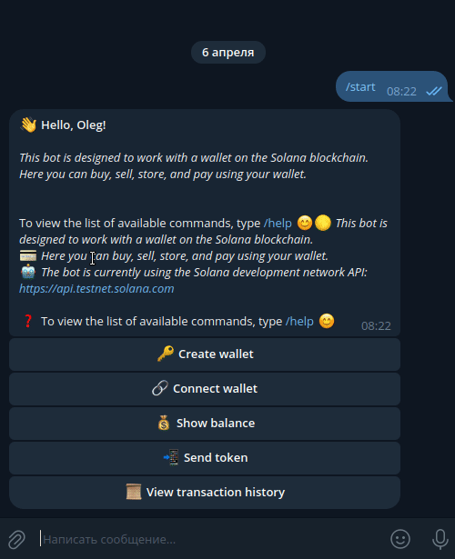
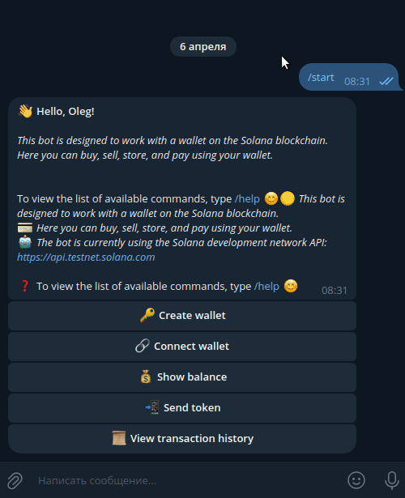
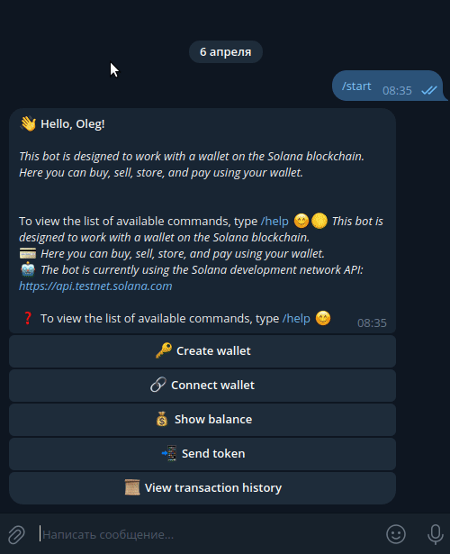

# Solana Telegram Wallet

This project is a full-featured Telegram bot for interacting with Solana wallets. The main goal is to provide a
convenient and secure interface for creating, managing, and performing operations with Solana wallets directly from
Telegram.

[](https://www.youtube-nocookie.com/embed/96TPWHDh5Gk)

## Preview Version

### SolanaWallet

- t.me/solana_wallet_crypto_bot
- @solana_wallet_crypto_bot
- SolanaWallet bot uses a test node - https://api.testnet.solana.com

### SolanaWallet-v2

- t.me/solana_wallet_crypto_v2_bot
- @solana_wallet_crypto_v2_bot
- SolanaWallet-v2 bot uses a test node - https://api.devnet.solana.com

## Installation

```bash
# clone the repository
git clone https://github.com/Shrekulka/solana-webwallet.git
cd solana-webwallet/
# install and activate the virtual environment
python3.12 -m venv env
source env/bin/activate
# insatll requirements
pip install -r requirements.txt
```

## Preparation before Use

Before running, you need to create and populate the .env settings file.

You need to specify your token for accessing the Telegram API and the database engine in it.

- Create a bot via BotFather on Telegram and obtain the token for your bot.
- Make sure that your bot has polling mode enabled for updates.

Example `.env`:

```bash
# Settings for the token and list of administrators for the bot.
# BOT_TOKEN - token for accessing the Telegram API.
BOT_TOKEN=5424991242:AAGwomxQz1p46bRi_2m3V7kvJlt5RjK9yr0
# ADMIN_IDS - list of bot administrator IDs, separated by comma.
ADMIN_IDS=[173901673,124543434,143343455]

# Settings for connecting to the database.
# DB_NAME - database name
DB_NAME=my_database
# DB_HOST - database host
DB_HOST=localhost
# DB_USER - database user
DB_USER=dbUser
# DB_PASSWORD - password
DB_PASSWORD=dbPassword
# DB_ENGINE - engine
DB_ENGINE=sqlite
# DB_ENGINE=postgresql
```

If `postgresql` is selected as the database, then you can run it in Docker.

### Running a container in docker `postgresql`

```bash
cd solana-webwallet/compose/
# start postgresql container:
docker-compose -f docker-compose.yml up -d
# stop:
docker-compose -f docker-compose.yml down -v
```

### Running a bot

```bash
cd solana-webwallet/
# if not activated yet, then activate the virtual environment
source env/bin/activate
# run the bot
python bot.py
```

## After run, the bot will be available on Telegram

### Creating a new Solana wallet



### Connecting an existing Solana wallet


### Send token



### Viewing transaction history



## Description of Functionality and Project Architecture

1. Creating a new Solana wallet:
    - When selecting the "Create Wallet" option in the bot's main menu, the process of creating a new Solana wallet
      begins.
    - The bot requests a name for the new wallet from the user, which must adhere to a specific pattern (only letters,
      numbers, spaces, and special characters: -_).
    - If the entered name is incorrect, the bot displays an error message and requests the name again.
    - After entering the correct name, the bot prompts the user to enter a description for the wallet (optional field).
      The description is also checked against a specific pattern (letters, numbers, spaces, and special characters:
      -_,.;:!?).
    - If the description is incorrect, the bot displays an error message and requests the description again.
    - After entering all the data, the bot generates a new key pair (public and private) for the Solana wallet using
      the solana-py library.
    - The public key is the address of the new wallet, and the private key is required for transactions and should be
      securely stored by the user.
    - The bot saves the wallet address, name, description, and user association in the database (SQLite or PostgreSQL).
    - The bot sends the user the address of the new wallet, name, description, and private key.
2. Connecting an existing Solana wallet:
    - When clicking the "Connect Wallet" button, the bot requests the user's address of an existing Solana wallet.
    - The bot validates the entered address using the is_valid_wallet_address function from the solana module.
    - If the address is invalid, the bot displays an error message and requests the address again.
    - The bot checks if this address has already been connected to the user's account.
    - If the address is already connected, the bot displays a corresponding message and requests another address.
    - If the address has not yet been connected, the bot requests a name and description for the wallet being connected
      from the user.
    - The name and description are checked against established patterns, as with creating a new wallet.
    - After successfully entering all the data, the bot saves the wallet address, name, description, and user
      association in the database.
    - The bot sends the user a message about the successful connection of the wallet.
3. Checking the balance:
    - When selecting the "Show Balance" option, the bot retrieves a list of all the user's connected wallets from the
      database.
    - For each wallet, the bot requests the current SOL balance from the Solana network using the get_sol_balance
      function from the solana module.
    - Wallet balances are cached in the wallet_balances_cache dictionary for performance improvement and reducing load
      on Solana network nodes.
    - The last cache update time is tracked using the cache_last_updated variable.
    - If the cache is stale (more than TRANSACTION_HISTORY_CACHE_DURATION seconds have passed) or empty, the bot
      requests the balances of all wallets from the Solana network and updates the cache.
    - The bot formats a message with information about each wallet (name, address, balance) and sends it to the user.
4. Send tokens:
    - When selecting the "Send tokens" option, the user receives a list of their connected wallets in the form of an
      inline keyboard using the get_wallet_keyboard function from the transfer_transaction_keyboards module.
    - After selecting the sender wallet from the list, the bot requests the user to enter the private key of the
      selected wallet to confirm the operation.
    - The bot validates the entered private key using the is_valid_private_key function from the solana module.
    - If the private key is incorrect, the bot displays an error message and requests it again.
    - The bot also checks if the entered private key corresponds to the address of the selected sender wallet.
    - After entering the correct private key, the user enters the recipient's address.
    - The bot validates the recipient's address using the is_valid_wallet_address function from the solana module.
    - If the address is invalid, the bot displays an error message and requests the address again.
    - Then the bot requests the user for the transfer amount.
    - The bot validates the entered amount using the is_valid_amount function from the solana module.
    - If the amount is incorrect, the bot displays an error message and requests the amount again.
    - The bot retrieves the current balance of the sender wallet from the Solana network and checks if there are enough
      funds for the transfer, taking into account the minimum balance required for rent exemption in Solana.
    - If the funds are insufficient, the bot displays a corresponding message and requests the transfer amount again.
    - If there are sufficient funds, the bot executes the token transfer using the transfer_token function from the
      solana module.
    - After a successful or unsuccessful transfer, the bot sends the user a corresponding notification.
    - Upon completion of the transfer process, the bot clears the state and returns the user to the main menu.
5. Viewing transaction history:
    - When selecting the "Show Transaction History" option, the user receives a list of their connected wallets in the
      form of an inline keyboard using the get_wallet_keyboard function from the transfer_transaction_keyboards module.
    - After selecting a wallet from the list, the bot requests the transaction history for that wallet from the Solana
      network using the get_transaction_history function from the solana module.
    - Transaction history is cached in the transaction_history_cache dictionary for performance improvement. The cache
      lifetime is determined by the TRANSACTION_HISTORY_CACHE_DURATION constant.
    - If the cache is stale or empty, the bot requests fresh transaction history from the Solana network and updates the
      cache.
    - The bot formats the received transaction data using the format_transaction_message function from the
      services/wallet_service module.
    - For each transaction, a message is formed with information about the transaction ID, sender and recipient
      addresses, and the transaction amount.
    - The formatted messages are combined into one large message and sent to the user.
    - If the transaction history is empty, the bot sends a corresponding notification.
    ##### Error Handling:
    - In case of errors during the request for transaction history, the bot notifies the user of the failure and
      suggests trying again later.
    - Errors are logged in detail to facilitate debugging and problem resolution.
    ##### State Transitions:
    - When selecting a wallet to view transaction history, the bot transitions to the
      FSMWallet.choose_transaction_wallet state.
    - After sending the transaction history, the state is reset to default_state, and the user is prompted to return to
      the main menu.
    Thus, the transaction history viewing function allows users to track all incoming and outgoing transactions for
    their Solana wallets connected to the bot. Transaction history is requested from the Solana network, cached for
    performance improvement, and displayed to the user in a convenient format. The bot handles various situations, such
    as the absence of transaction history or errors when interacting with the Solana network, by notifying the user with
    appropriate messages.

## Overall Conclusion
The presented Telegram bot project for managing Solana wallets is a fully functional and well-designed application. It
provides users with the ability to create new Solana wallets, connect existing ones, track balances, transfer tokens
between wallets, and view transaction history.
The project follows modern software development practices, with clear division into modules and components, ensuring
good maintainability and extensibility of the code. The use of the `aiogram` framework and solana-py library facilitates
interaction with the Telegram and Solana APIs respectively.
Thanks to the use of finite state machines (FSMs), the bot is able to track the current interaction state with the user
and respond accordingly to their input. This provides a smooth and intuitive user experience.
Error handling and exception handling are implemented at a high level, with detailed error logging to facilitate
debugging. Caching of data such as wallet balances and transaction history improves performance and reduces load on
Solana network nodes.
Overall, this project demonstrates a deep understanding of software design principles by the developers, interaction
with external APIs, and ensuring a quality user experience. The bot is ready for deployment and use by the Solana
community for secure and convenient management of cryptocurrency wallets.

## Project Structure

```bash
📁 solana_wallet_telegram_bot/                    # Project directory containing the main bot files
│
├── .env                                          # File with environment variables such as bot token and secrets
│
├── .env.example                                  # Example .env file for other developers
│
├── .gitignore                                    # File indicating to Git which files and directories to ignore
│
├── bot.py                                        # Main project file, entry point for running the bot
│
├── requirements.txt                              # File listing project dependencies for installation via pip
│
├── requirements.in                               # Dependency file for the project in ini format
│
├── logger_config.py                              # Logger configuration file for logging
│
├── README.md                                     # File with project description and instructions
│
├── *.db                                          # SQLite database file used in the project
│
├── 📁 compose/                                   # Directory for Docker Compose files
│   └── docker-compose.yml                        # Docker Compose file for running containers
│
├── 📁 config_data/                               # Package with configuration data
│   ├── __init__.py                               # File indicating that the directory is a Python package
│   └── config.py                                 # Module with configuration data
│
├── 📁 database/                                  # Package for working with the database
│   ├── __init__.py                               # Package initializer file
│   └── database.py                               # Module with the database template
│
├── 📁 docs/                                      # Directory for documentation media files
│   ├── 📁demo/                                   # Directory for demonstration files with videos
│   └── 📁img/                                    # Directory for demonstration files with images
│
├── 📁 external_services/                         # Package for interacting with external services and APIs
│    ├── 📁 solana/                               # Subpackage related to integration with Solana
│    │    ├── __init__.py                         # Subpackage initializer file
│    │    └── solana.py                           # Module with functions for working with Solana wallets and transactions
│    └── __init__.py                              # Package initializer file for external_services
│
├── 📁 handlers/                                  # Package with command and request handlers for the bot
│   ├── __init__.py                               # Package initializer file
│   ├── back_button_handler.py                    # Handler for pressing the "Back" button
│   ├── connect_wallet_handlers.py                # Handlers for connecting an existing wallet
│   ├── create_wallet_handlers.py                 # Handlers for creating a new wallet
│   ├── other_handlers.py                         # Handlers for unexpected commands and messages
│   ├── transaction_handlers.py                   # Handlers for viewing transaction history
│   ├── transfer_handlers.py                      # Handlers for transferring tokens
│   └── user_handlers.py                          # Handlers for user-related commands
│
├── 📁 keyboards/                                 # Package with modules for working with bot keyboards
│   ├── __init__.py                               # Package initializer file
│   ├── back_keyboard.py                          # Module for creating a keyboard with a "Back" button
│   ├── main_keyboard.py                          # Module for creating the main bot keyboard
│   └── transfer_transaction_keyboards.py         # Module for creating keyboards for token transfer and history view
│
├── 📁 lexicon/                                   # Package for storing bot response texts
│   ├── __init__.py                               # Package initializer file
│   └── lexicon_en.py                             # Module with texts in English
│
├── 📁 models/                                    # Package with data models for the database
│   ├── __init__.py                               # Package initializer file
│   └── models.py                                 # Contains data model definitions for SQLAlchemy ORM
│
├── 📁 services/                                  # Package with services for working with data
│   ├── __init__.py                               # Package initializer file
│   └── wallet_service.py                         # Module with services for working with wallets
│
├── 📁 states/                                    # Package with user state classes
│   ├── __init__.py                               # Package initializer file
│   └── states.py                                 # Module with user state classes
│
└── 📁 utils/                                     # Package with auxiliary modules
    ├── __init__.py                               # Package initializer file
    └── validators.py                             # Module with functions for data validation
```
